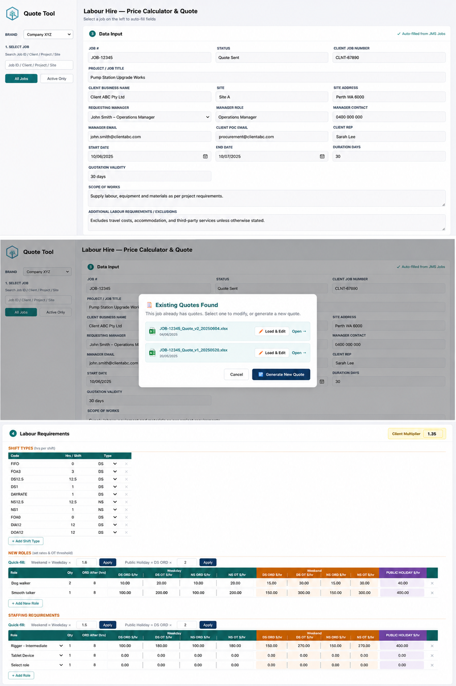
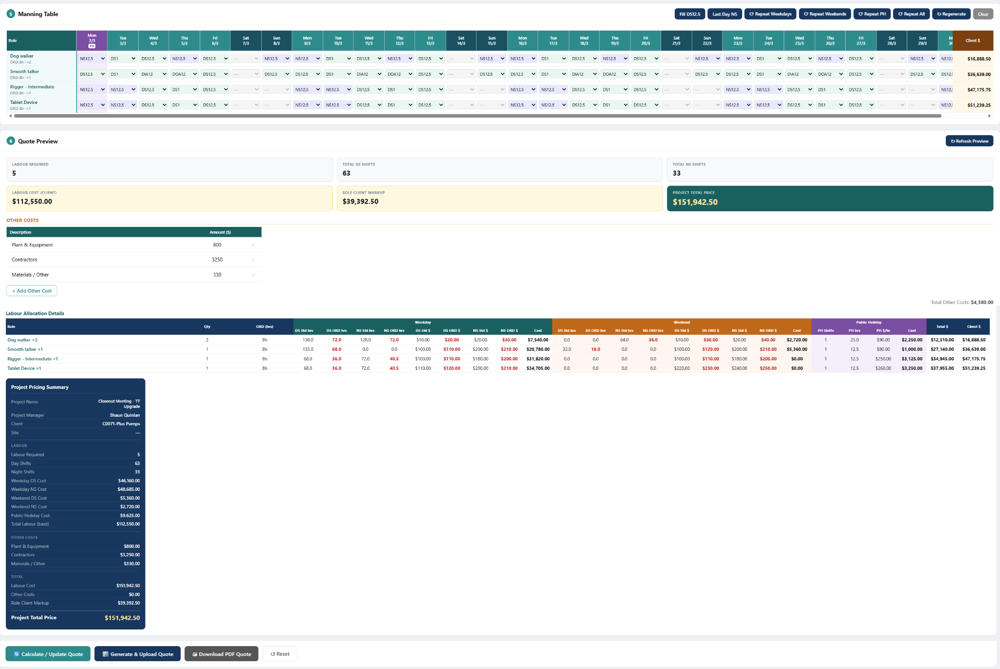
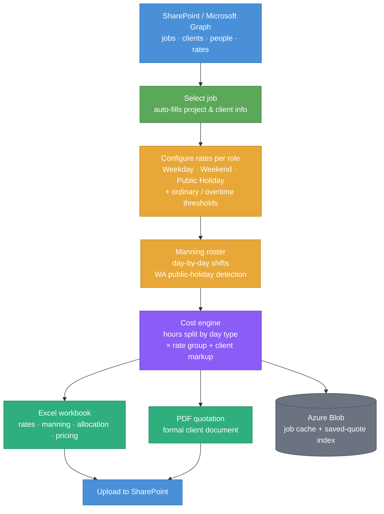

# Labour Hire — Online Quote & Pricing Tool

A Flask web app that builds labour-hire quotes end to end: pulls live job & client data from **SharePoint (Microsoft Graph)**, configures tiered shift rates, builds a day-by-day manning roster, then generates a polished **Excel** workbook and formal **PDF** quotation — uploaded straight back to SharePoint. Built for mining, civil and industrial labour hire; deployed on **Azure App Service**.

---

## Screenshots

### Rate configuration & live cost calculation



### Manning roster & pricing summary



---

## How it works



---

## Features

- **Live SharePoint integration** — jobs, clients, people and rates via Microsoft Graph (client-credentials auth); selecting a job auto-fills the whole form
- **Tiered rate model** — separate weekday / weekend / public-holiday rates, with ordinary + overtime (ORD) thresholds per role
- **Automatic WA public-holiday detection** — holiday dates drive which rate group applies, no manual flagging
- **Manning roster** — day-by-day shift grid with one-click *Repeat week / weekday / weekend / public-holiday* pattern fill and PH highlighting
- **Live cost engine** — hours split by day type × matching rate group, plus client markup, with real-time pricing summary
- **Excel generator** (openpyxl) — project info, rate card, manning table, grouped cost-allocation breakdown and pricing summary
- **PDF generator** (reportlab) — a formal, client-ready quotation document
- **Azure Blob storage** with transparent local-file fallback for dev, and gzipped responses for fast page loads

---

## Tech Stack

| Layer | Technology |
|-------|------------|
| Backend | Python, Flask |
| Data source | SharePoint via Microsoft Graph API |
| Storage | Azure Blob Storage (local-file fallback) |
| Excel | openpyxl |
| PDF | reportlab |
| Hosting | Azure App Service (gunicorn) |

---

## Setup

### 1. Clone the repo

```bash
git clone https://github.com/Pearlluo/labour-hire-quote-system.git
cd labour-hire-quote-system
```

### 2. Install dependencies

```bash
pip install -r requirements.txt
```

### 3. Configure `.env`

```env
# Microsoft Graph (SharePoint)
SHAREPOINT_TENANT_ID=your-tenant-guid
SHAREPOINT_CLIENT_ID=your-app-client-id
SHAREPOINT_CLIENT_SECRET=your-app-client-secret
SHAREPOINT_HOST=yourtenant.sharepoint.com
SITE_NAME=BMS
SITE_NAME1=IMS

# Azure Blob Storage
BLOB_CONNECTION_STRING=your_azure_connection_string
CONTAINER=online-quote
```

### 4. Run

```bash
python app.py --serve
```

Visit `http://localhost:5000`. Run `python app.py` (no `--serve`) to refresh the job cache from SharePoint.

---

## Usage

1. **Pick a job** — project, client, site and dates auto-fill from SharePoint
2. **Set rates** per role — weekday, weekend and public-holiday `$/hr`
3. **Build the manning roster** — fill shifts day by day, or use *Repeat* buttons to copy a week forward
4. **Review the live pricing summary** — cost split by weekday / weekend / PH, markup and project total
5. **Generate & Upload Quote** (Excel → SharePoint) or **Download PDF Quote**

---

## Project Structure

```
labour-hire-quote-system/
├── app.py                 # Flask routes, page rendering, orchestration
├── graph_client.py        # Microsoft Graph auth + REST helpers
├── operations_folders.py  # SharePoint folder discovery & file upload
├── excel_generator.py     # Excel quote workbook
├── pdf_generator.py       # PDF quotation document
├── wa_holidays.py         # WA public-holiday calendar
├── storage.py             # Azure Blob / local-file persistence
├── blob_index.py          # Saved-quote index
├── requirements.txt
├── DEPLOY.md              # Azure App Service deployment guide
└── templates/
    └── html3.html         # Frontend UI
```

---

## Notes

- **Data storage** — `quote_data.json` (job cache) and `quotes.json` (saved-quote index) live in Azure Blob Storage when `BLOB_CONNECTION_STRING` is set, otherwise in a local folder
- **Refresh** — re-sync the job cache from SharePoint via `/api/refresh-data` or `python app.py`
- **Security** — all secrets are supplied via `.env` / Azure App Settings and are **never committed**
- **Deployment** — see [`DEPLOY.md`](DEPLOY.md) for the full Azure App Service + GitHub CI/CD setup
